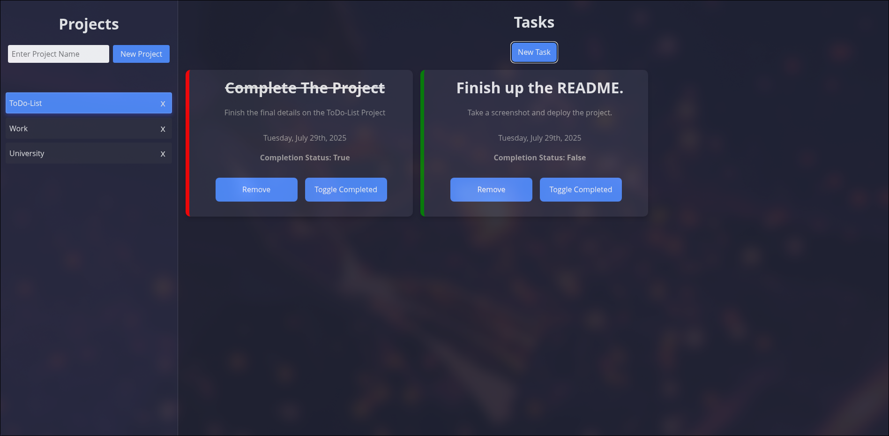

# ToDo List App

A simple and modular ToDo List Application built with JavaScript, Webpack, HTML, and CSS which utilizes Local Storage to save user information.
Users can create projects, create/edit tasks, and mark them as complete to organize their work.

---

## Live Demo

**[View the Live App Here!](https://deeppatel-dev.github.io/ToDo-List/)**

---

## Features

- Create and delete **projects**
- Add, edit, and remove **tasks** inside each project
- Mark tasks as complete or incomplete
- Data is stored in **Local Storage** (data remains on website reload)

---

## Screenshot



---

## Installation and Usage

Clone the project

```bash
  git clone https://github.com/deeppatel-dev/ToDo-List.git
```

Go to the project directory

```bash
  cd ToDo-List
```

Install dependencies

```bash
  npm install
```

Start the server

```bash
  npm run dev
```

